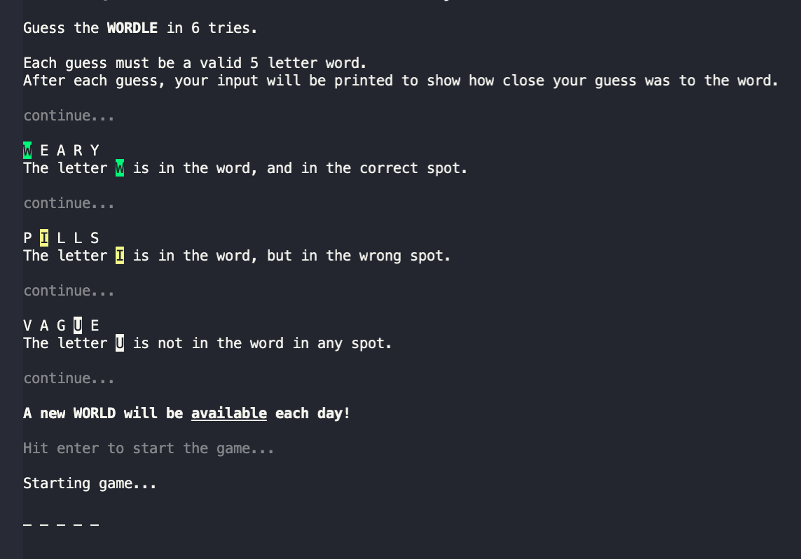
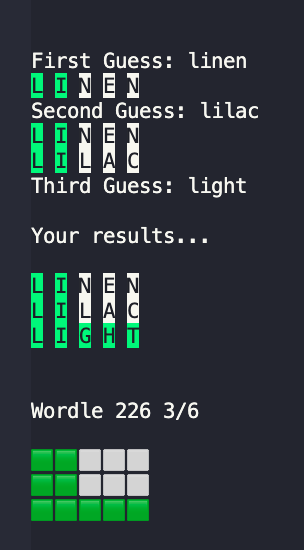

# wordle-cli
A JavaScript CLI implementation of [Wordle](https://www.powerlanguage.co.uk/wordle/).

I was able to make this through the reverse engineering done by Robert Reichel's blog post: [Reverse Engineering Wordle](https://reichel.dev/blog/reverse-engineering-wordle.html#looking-for-network-requests)

## Usage
```bash
npm start
```
```bash
node index.js
```
## Example



